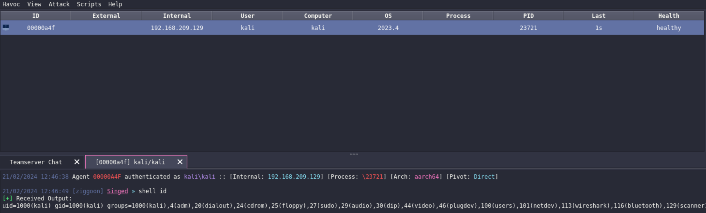

# singed
> singed is a 3rd-party Linux agent for Havoc

the agent communicates over plain, unencrypted http - nothing the agent does is necessarily opsec-safe, i was using this project to learn more about havoc and the service api.
in the future, i plan to implement encrypted communication along with other post-exploitation / persistence methods

`handler.py` is the handler that interacts with the Havoc Agent Service and handles all agent requests


## Installation
1. clone repo & submodules
```sh
git clone --recurse-submodules https://github.com/ziggoon/singed.git; cd singed
```
2. run installation script
```sh
chmod +x setup.sh; ./setup.sh
```
3. start havoc server & client
4. copy `handler.py` into `havoc-py`
```sh
cp handler.py havoc-py
```
5. run `handler.py`
```sh
python3 handler.py
```

## Features


* execute shell commands
* upload and download files

## Release History
* 0.1.2
    * Add basic system commands: ls, cd, pwd
* 0.1.1
    * Add upload file feature
    * Add download file feature
* 0.1.0
    * initial release
