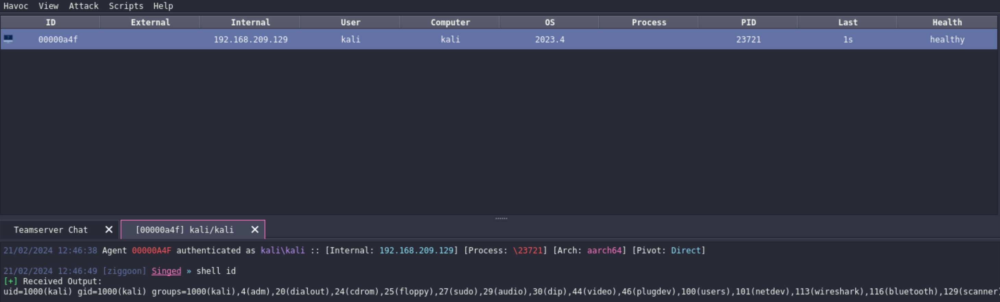

# singed
> singed is a 3rd-party Linux agent for Havoc

the agent communicates over plain, unencrypted http - nothing the agent does is necessarily opsec-safe, i was using this project to learn more about havoc and the service api.
in the future, i plan to implement encrypted communication along with other post-exploitation / persistence methods

`handler.py` is the handler that interacts with the Havoc Agent Service and handles all agent requests

## Features

* execute shell commands

## Release History
* 0.1.1
    * Add upload file feature
    * Add download file feature
* 0.1.0
    * initial release
